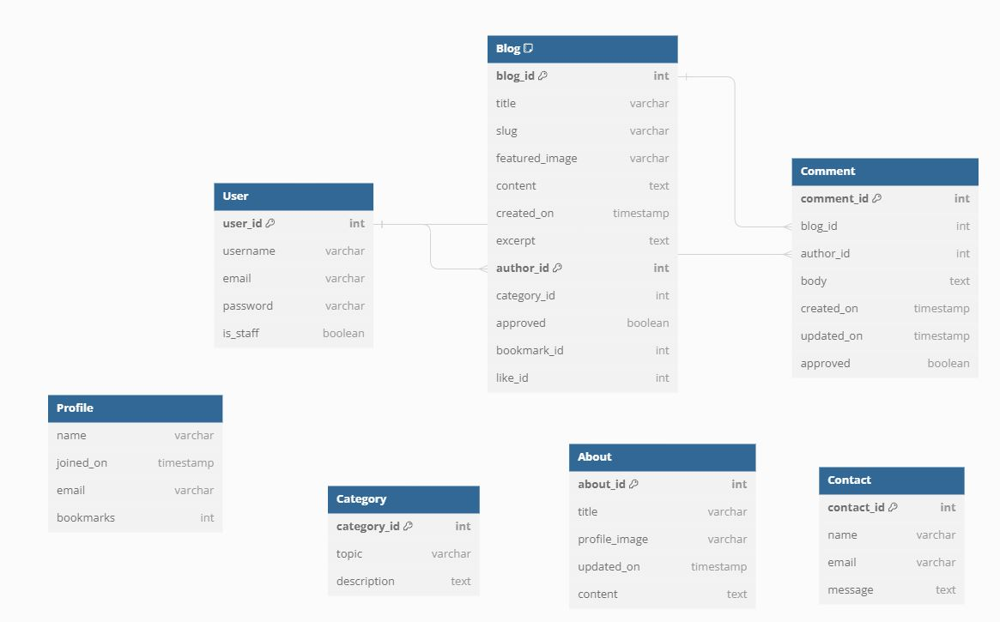

  

<h1 align="center">Software Stacks</h1>

<h2>Welcome</h2>

Link to live website: [CLICK HERE!](https://software-stacks-442e4344b2ad.herokuapp.com/)

# Introduction

## Software Stacks

Welcome to [**Software Stacks**](https://software-stacks-442e4344b2ad.herokuapp.com/), its a dynamic blog platform designed to navigate the evolving landscape of technology. It serves as a bridge connecting enthusiasts, professionals, and curious minds to the core areas of **Advanced Front-End Development**, **E-Commerce**, and **Predictive Analysis**. At Software Stacks, we're committed to demystifying complex tech concepts, showcasing the latest trends, and fostering a community where knowledge and innovation flourish. Whether you're looking to dive deep into code, explore digital commerce, or unlock insights through data analytics, Software Stacks is your go-to digital compass in the tech world.

**Software Stacks** focusing on Django and Bootstrap frameworks, Database manipulation and CRUD functionality. It is for educational purposes only.

### Our Website Features

Software Stacks offers a range of features to engage our community, including:

- **Educational Blog Posts:** Dive deep into comprehensive articles covering advanced front-end development, e-commerce solutions, and predictive analytics. Our posts are tailored to inform, educate, and inspire.
- **Community Interaction:** Engage with posts through comments, likes, and bookmarks. Add new posts and Share your thoughts, ask questions, and interact with other members of the community.
- **Resource Hub:** Access a curated selection of resources, and guides. Whether it's learning a new programming language or understanding the nuances of digital marketing in e-commerce, our resource hub has you covered.
- **User Contributions:** Registered users can contribute their own posts, share their expertise, and add to the collective knowledge base of Software Stacks.

### Get Involved

Join Software Stacks today and become part of a community that's shaping the future of technology. Whether you're here to learn, share, or simply explore, we welcome you to our platform. Let's navigate the vast landscape of technology together!

# Table of Contents
- [Introduction](#introduction)
  - [Software Stacks](#software-stacks)
    - [Our Website Features](#our-website-features)
    - [Get Involved](#get-involved)
- [Table of Contents](#table-of-contents)
- [Overview](#overview)
- [UX - User Experience](#ux---user-experience)
- [Design](#design)
  - [Colour Scheme](#colour-scheme)
  - [Fonts](#fonts)
    - [Google Fonts](#google-fonts)
      - [Roboto](#roboto)
      - [Lato](#lato)
- [Project Planning](#project-planning)
  - [Strategy Plane](#strategy-plane)
  - [Agile Methodologies - Project Management:](#agile-methodologies---project-management)
    - [Story Points Allocation](#story-points-allocation)
    - [Sprint Planning Example](#sprint-planning-example)
    - [MoSCoW Prioritization:](#moscow-prioritization)
    - [User Stories, Milestones and Epics](#user-stories-milestones-and-epics)
      - [Users Stories](#users-stories)
      - [Milestones](#milestones)
      - [Epics](#epics)
        - [Epic 1: User Engagement and Interaction](#epic-1-user-engagement-and-interaction)
        - [Epic 2: User Account Management](#epic-2-user-account-management)
        - [Epic 3: Core Platform Development](#epic-3-core-platform-development)
        - [Epic 4: Content Management and Administration](#epic-4-content-management-and-administration)
        - [Epic 5: Community Building and Feedback](#epic-5-community-building-and-feedback)
        - [Epic 6: Documentation and Quality Assurance](#epic-6-documentation-and-quality-assurance)
  - [Scope Plane](#scope-plane)
  - [Structural Plane](#structural-plane)
  - [Skeleton \& Surface Planes](#skeleton--surface-planes)
    - [Wireframes](#wireframes)
      - [Home Page Wireframes](#home-page-wireframes)
      - [Categories Page Wireframes](#categories-page-wireframes)
      - [Post Detail Page Wireframes](#post-detail-page-wireframes)
      - [About \& Contact Page Wireframes](#about--contact-page-wireframes)
      - [Add Post Page Wireframes](#add-post-page-wireframes)
      - [Register Page Wireframes](#register-page-wireframes)
      - [Login Page Wireframes](#login-page-wireframes)
      - [Logout Page Wireframes](#logout-page-wireframes)
      - [My Bookmarks Page Wireframes](#my-bookmarks-page-wireframes)
      - [My Likes Page Wireframes](#my-likes-page-wireframes)
      - [My Comments Page Wireframes](#my-comments-page-wireframes)
      - [My Posts Page Wireframes](#my-posts-page-wireframes)
    - [Database Schema - Entity Relationship Diagram](#database-schema---entity-relationship-diagram)
      - [Database Schema](#database-schema)
      - [Entity Relationship Diagram (ERD)](#entity-relationship-diagram-erd)
      - [Tables Overview](#tables-overview)
      - [Relationships](#relationships)
      - [Design Considerations](#design-considerations)
    - [Security](#security)
      - [Data Encryption](#data-encryption)
      - [CSRF Tokens](#csrf-tokens)
      - [AllAuth](#allauth)
- [Features](#features)
  - [Existing Features](#existing-features)
    - [Features Functionality](#features-functionality)
    - [CRUD Functionality](#crud-functionality)
    - [All Existing Features with Screenshots](#all-existing-features-with-screenshots)
      - [Home Page](#home-page)
      - [User Registration, Login, and Logout](#user-registration-login-and-logout)
      - [User Profile](#user-profile)
      - [Add Post](#add-post)
      - [Search Functionality](#search-functionality)
      - [Post Details](#post-details)
      - [Comments and Interactions](#comments-and-interactions)
      - [Responsive Navigation Bar](#responsive-navigation-bar)
      - [Categories](#categories)
      - [My Bookmarks](#my-bookmarks)
      - [My Likes](#my-likes)
      - [My Comments](#my-comments)
      - [My Posts](#my-posts)
      - [Pagination](#pagination)
      - [Footer](#footer)
      - [Admin Panel](#admin-panel)
      - [Error Handling](#error-handling)
  - [Future Features](#future-features)
- [Technology Used](#technology-used)
  - [Frontend](#frontend)
  - [Backend](#backend)
  - [Deployment and Version Control](#deployment-and-version-control)
  - [Development Tools](#development-tools)
  - [Libraries and Frameworks](#libraries-and-frameworks)
  - [Validation Tools](#validation-tools)
  - [Others](#others)
- [Testing](#testing)
- [Deployment](#deployment)
  - [GitHub](#github)
  - [Gitpod](#gitpod)
  - [Heroku](#heroku)
  - [ElephantSQL](#elephantsql)
  - [Cloudinary](#cloudinary)
- [Cloning and Forking](#cloning-and-forking)
  - [Cloning the Repository](#cloning-the-repository)
  - [Forking the Repository](#forking-the-repository)
- [Credits](#credits)
  - [Code](#code)
  - [Media](#media)
  - [Additional reading/tutorials/books/blogs](#additional-readingtutorialsbooksblogs)
  - [Acknowledgements](#acknowledgements)

# Overview

Software Stacks is an engaging web platform dedicated to the exploration and empowerment within the realms of Advanced Front-End Development, E-Commerce, and Predictive Analysis. It serves as a communal hub for:

- Joining a vibrant community of tech enthusiasts and professionals.
- Creating personalized user profiles to share experiences and insights.
- Contributing and interacting with comprehensive posts.
- Discovering cutting-edge trends and best practices in technology domains.
- Facilitating discussions and exchanges within a supportive community.

Accessible across various devices and browsers, Software Stacks aims to simplify complex technology concepts, making them accessible to a diverse audience. Whether you're an experienced developer, an aspiring entrepreneur, or a curious learner, the platform offers tailored resources to support your journey in technology. 

Software Stacks envisions fostering a collaborative ecosystem where users can learn, share, and grow together. By engaging with the platform, members can stay ahead of industry trends, enhance their technical skills, and connect with like-minded individuals. As the platform evolves, future enhancements will include advanced interactive features, further enriching the user experience and community engagement.

# UX - User Experience

The UX design of Software Stacks focuses on simplicity, accessibility, and community engagement to ensure a pleasant and productive experience for all users. Here’s a straightforward breakdown:

- **Intuitive Layout**: Easy-to-navigate menus and a clear structure make finding information straightforward for users of all tech levels.
- **Responsive Design**: The site works smoothly on any device, ensuring users can access content at home or on the move.
- **Engaging Content**: All content is designed to be interesting and useful, with opportunities for users to interact through comments, likes, bookmarks, and write their own posts.
- **Personalization**: Users can customize their experience by setting up profiles, which enhances engagement and helps tailor content to their interests.
- **Community Focus**: It is easy for users to connect, share, and learn from each other.

Overall, the UX design aims to make Software Stacks a welcoming, easy-to-use platform that meets the needs of its diverse user base.

# Design

## Colour Scheme

The color scheme for Software Stacks is designed to create a visually appealing and user-friendly interface. Here's a detailed breakdown:

[Coolors](https://coolors.co/) - Colour Scheme for SoftawreStacks website

  
- **#003459 (Navy Blue)**: Used primarily in the `.dark-bg` class for navigation bars, footers, and certain buttons. This deep shade of blue conveys reliability and professionalism, anchoring the design with its strong presence.

- **#007EA7 (Teal)**: This vibrant shade is employed for hover states (`.custom-search-btn:hover`), links, and other interactive elements, adding a pop of color that invites user interaction. It also serves as the color for important buttons and links, guiding users' attention to key actions.

- **#00A8E8 (Deep Teal)**: Utilized for `.btn-signup` and `.btn-edit`, this color denotes actions and editable content, offering a visual cue to users about interactive elements.

- **#E84610 (Bright Red-Orange)**: Allocated for the `.btn-delete` class, this color acts as a warning or alert, indicating a potentially irreversible action, such as deleting content. It's designed to grab attention and prompt the user to proceed with caution.

- **#FFFFFF (White)** and **#00171F (Almost Black)**: These colors are used throughout the `.main-content` and text, ensuring excellent contrast and legibility. White backgrounds for cards and black text create a clean, modern look that's easy on the eyes.

- Additional accents like **#237dd1 (Bright Blue)** for the `.image-flash`, along with hover effects (`:hover` states) and specific icons (`.like-icon i, .bookmark-icon i`), enhance the website's interactive feel, using color to guide and inform user interactions.

This carefully chosen palette not only enhances the aesthetic appeal of Software Stacks but also supports usability and accessibility, making the platform welcoming and easy to navigate for all users.

## Fonts

For the **Software Stacks** project, the selection of fonts plays a crucial role in enhancing readability, ensuring accessibility, and contributing to the overall aesthetic of the application. Below is a detailed explanation of the fonts used in the project, along with their characteristics and reasons for selection.

### Google Fonts

**Software Stacks** utilizes fonts from [Google Fonts](https://fonts.google.com/), a library of free licensed font families, due to its wide variety of choices and easy integration into web projects. Here are the specific fonts used:

#### Roboto
- **Usage**: Primarily for body text.
- **Characteristics**: Modern, sans-serif. Offers great readability on digital screens. Designed with an open curve, making it accessible and friendly to users.
- **Reason for Selection**: Roboto is highly versatile, making it suitable for both body text and headings. Its clear and crisp lines ensure that the content is easy to read, enhancing user engagement.

[Roboto on Google Fonts](https://fonts.google.com/specimen/Roboto)

#### Lato
- **Usage**: Headings and important callouts.
- **Characteristics**: Sans-serif. Features a mixture of curves and straight lines, providing a balance between professionalism and warmth.
- **Reason for Selection**: The semi-rounded details of the letters give Lato a feeling of warmth, while the strong structure provides stability and seriousness. This combination makes it perfect for drawing attention to section headings and important information.

[Lato on Google Fonts](https://fonts.google.com/specimen/Lato)

# Project Planning

## Strategy Plane

**Project Overview:**  
Software Stacks aims to create a centralized platform where users can explore, learn, and interact with content related to various software development technologies. This includes front-end development, e-commerce solutions, and predictive analytics. The platform will serve as an educational hub, community forum, and resource center for both novice and experienced developers.

**Site Goals:**
- Provide a robust resource for learning and discussion around key software development topics.
- Foster a community of developers who can share insights, code snippets, and best practices.
- Maintain a user-friendly interface that caters to both desktop and mobile users, ensuring accessibility and ease of navigation.
- Enable scalable features that can evolve with technological advancements and user feedback.

## Agile Methodologies - Project Management:  
Software Stacks adopts Agile project management to ensure iterative development and continuous improvement. The use of GitHub Projects or similar tools will facilitate task management, tracking progress through a Kanban-style board.

### Story Points Allocation

**Story Points Distribution**
Story points were assigned to each user story to quantify the effort and complexity involved. These points helped us estimate the workload and prioritize our tasks effectively.

**Allocation Guidelines:**
- **Must-have Stories**: Essential features that are fundamental for the project's operations were given the highest priority.
- **Should-have Stories**: Important but not critical features that enhance the user experience without being essential to the core functionality. According to our project management guidelines, the total story points assigned to "Should-have" stories did not exceed 60% of the total points in any sprint. This ensured that essential features were developed first and resources were not overextended on less critical functionalities.
- **Could-have Stories**: Desirable features that were considered only after fulfilling the "Must-have" and "Should-have" categories.

### Sprint Planning Example
Here is an example of how story points are managed and allocated across different categories in sprints:

- **Total Story Points for the Sprint**: 100
- **Must-have Points**: 40 (40% of the total)
- **Should-have Points**: 50 (50% of the total)
- **Could-have Points**: 10 (10% of the total)

**Example Milestones:**
- **Milestone 1: Core Functionality**
  - Total Story Points: 60
  - Breakdown:
    - Must-have: 36 points
    - Should-have: 24 points
- **Milestone 2: Enhanced User Experience**
  - Total Story Points: 80
  - Breakdown:
    - Must-have: 32 points
    - Should-have: 48 points

### MoSCoW Prioritization: 
To effectively manage project scope, Software Stacks will implement the MoSCoW prioritization method:
- **Must Haves**: Core functionalities that include article browsing, user registration/login, and interactive forums.
- **Should Haves**: Enhanced features like user profiles, article bookmarking, and advanced search capabilities.
- **Could Haves**: Additional functionalities such as personalized learning paths, user badges for engagement, and API integrations for pulling in external content.
- **Won't Haves**: Features that are not essential for the initial launch phase, such as a full-fledged online course module or third-party advertising.

### User Stories, Milestones and Epics

#### Users Stories

**User stories** are a brief statement of intent that captures what a user does or needs to do as part of their job function. They are written in non-technical language and focus on the value or outcome that the user

| Title | User Story | MoSCoW Priority | Milestone |
|-------|------------|----------|-----------|
| Comment on a Post | As a **user**, I want to **comment on a post** so that I can **engage with the content**. | **MUST HAVE** | Core Functionality |
| Bookmark Blog Posts | As a **user**, I want to **bookmark blog posts** so that I can **easily find them later**. | **SHOULD HAVE** | Core Functionality |
| Like Blog Posts | As a **user**, I want to **like blog posts** so that I can **express my appreciation for the content**. | **MUST HAVE** | Core Functionality |
| Account Registration | As a **user**, I want to **register an account** so that I can **interact with the site's features**. | **MUST HAVE** | Core Functionality |
| Browse Without Logging In | As a **user**, I want to **browse without logging in** so that I can **view content without an account**. | **MUST HAVE** | Core Functionality |
| 'Register' and 'Login' Buttons Disappear After 'Login' | As a **user**, I want **'Register' and 'Login' buttons to disappear after 'Login'** so that I can **know I'm logged in**. | **MUST HAVE** | Core Functionality |
| Manage My Posts | As a **user**, I want to **manage my posts** so that I can **control the content I have created**. | **MUST HAVE** | Core Functionality |
| Create Drafts | As a **user**, I want to **create drafts** so that I can **save my content before publishing**. | **MUST HAVE** | Core Functionality |
| Search Blog Posts | As a **user**, I want to **search blog posts** so that I can **find content relevant to my interests**. | **SHOULD HAVE** | Enhanced User Experience |
| View Paginated List of Posts | As a **user**, I want to **view a paginated list of posts** so that I can **easily navigate through content**. | **SHOULD HAVE** | Enhanced User Experience |
| Browse Categories | As a **user**, I want to **browse categories** so that I can **filter the posts by topics of interest**. | **SHOULD HAVE** | Enhanced User Experience |
| Enhance Data Validation | As a **user**, I want **to enhance data validation** so that I can **ensure the integrity of my inputs**. | **SHOULD HAVE** | Enhanced User Experience |
| Edit Existing Blog Post | As a **user**, I want to **edit my existing blog post** so that I can **update or correct information**. | **MUST HAVE** | Content Management |
| Implement Comprehensive Testing | As a **user**, I want to **implement comprehensive testing** so that I can **ensure the application functions correctly**. | **MUST HAVE** | Content Management |
| Delete Existing Blog Posts | As a **user**, I want to **delete existing blog posts** so that I can **remove outdated or incorrect content**. | **SHOULD HAVE** | Content Management |
| Submit Contact Form | As a **user**, I want to **submit a contact form and see it marked as 'read' by site owner** so that I can **know my inquiry has been acknowledged**. | **COULD HAVE** | Community Interaction |
| Modify or Delete My Comment on a Post | As a **user**, I want to **modify or delete my comment on a post** so that I can **manage my interactions**. | **COULD HAVE** | Community Interaction |
| Create Comprehensive Documentation | As a **developer**, I want to **create comprehensive documentation** so that **users and other developers can understand and use the site effectively**. | **MUST HAVE** | Future Considerations |

[Software Stacks GitHub Link](https://github.com/SwathiKeshavamurthy/SoftwareStacks-P4)

[Software Stacks Kanban Board Link](https://github.com/users/SwathiKeshavamurthy/projects/9)

[Software Stacks User Stories Link](https://github.com/SwathiKeshavamurthy/SoftwareStacks-P4/issues?q=is%3Aissue+is%3Aclosed)

[Software Stacks Milestones Link](https://github.com/SwathiKeshavamurthy/SoftwareStacks-P4/milestones)

#### Milestones

**A milestone**, here from above table represents a significant checkpoint or goal in a project's timeline. Milestones are used to signify the completion of a key phase of work, the achievement of a major objective, or the meeting of a significant deadline. They are critical for tracking progress, setting deadlines, and aligning the team and stakeholders around key project events or achievements. Unlike tasks or user stories, milestones don't involve work themselves but are markers indicating that a specific set of work has been completed.

#### Epics

**An epic** in software development and project management is a large body of work that can be broken down into smaller tasks or stories, often referred to as user stories. Epics are used to organize related tasks that contribute toward a significant, unified objective within a project. They help teams to focus on bigger-picture goals and ensure that all the smaller tasks (user stories) are aligned towards achieving that overarching aim. Epics typically span across multiple sprints or iterations and can take several weeks or months to complete.

##### Epic 1: User Engagement and Interaction
- **Goal:** Enhance user engagement and community interaction through posts, comments, and social features.
- **Associated User Stories:**
  - Comment on a post
  - Bookmark Blog Posts
  - Like Blog Posts
  - View paginated list of posts
  - Search Blog Posts
  - View comments
  - Navigate easily
  - Modify or delete comment on a post
  - Inquiry via Contact Section

##### Epic 2: User Account Management
- **Goal:** Provide a seamless and secure user experience from account registration through to content management.
- **Associated User Stories:**
  - Account Registration
  - 'Register' and 'Login' buttons disappear after 'Login'.
  - Manage posts
  - Create drafts
  - Edit Existing Blog Post
  - Approve comments
  - Delete Existing Blog Post
  - Add Post USER STORY: Allow Registered user to Create New Posts

##### Epic 3: Core Platform Development
- **Goal:** Establish the foundational elements of the Software Stacks platform, including database creation, deployment, and basic functionalities.
- **Associated User Stories:**
  - Creating the Database in ElephantSQL
  - Deploying the Django Project on Heroku
  - Software Stacks Blog
  - Create Project App
  - Open a Post
  - Browse without Logging in

##### Epic 4: Content Management and Administration
- **Goal:** Empower authors with comprehensive tools for content creation, modification, and management.
- **Associated User Stories:**
  - EDIT POST USER STORY: Enable Post Modifications by Author/Post Owner.
  - DELETE POST USER STORY: Facilitate Removal of Outdated or Incorrect Posts
  - ADD POST USER STORY: Allow Registered user to Create New Posts
  - TESTING: Implement Comprehensive Testing
  - VALIDATION: Enhance Data Validation

##### Epic 5: Community Building and Feedback
- **Goal:** Foster community interaction and feedback through enhanced contact form functionalities and about page updates.
- **Associated User Stories:**
  - CONTACT FORM USER STORY: Marking Contact Requests as "Read"
  - CONTACT FORM USER STORY: Contact Form Submission Feature(Site Owner)
  - CONTACT FORM USER STORY: Contact Form Submission Feature (Registered User)
  - ABOUT APP USER STORY: Add and update the about text
  - ABOUT APP USER STORY: Read about the site

##### Epic 6: Documentation and Quality Assurance
- **Goal:** Ensure the platform's reliability and ease of use through comprehensive documentation, testing, and data validation.
- **Associated User Stories:**
  - DOCUMENTATION: Create Comprehensive Documentation
  - VALIDATION: Enhance Data Validation
  - TESTING: Implement Comprehensive Testing

Each epic captures a significant area of functionality or development goal, providing a roadmap for progressing from initial platform setup to a fully-featured, user-engaged community platform.

## Scope Plane

**Purpose:**
Software Stacks aims to educate and engage users interested in various software technologies, focusing on Front-End Development, E-Commerce, and Predictive Analysis. It serves as a platform for both novice and experienced developers to explore articles, tutorials, and community insights.

**Goals:**
- Provide comprehensive guides and articles on key software development topics.
- Offer a community-driven platform where users can interact, and learn from each other.
- Enable users to stay updated with the latest trends and best practices in software technology.

**Target Audience:**
- Novice to experienced software developers.
- Individuals interested in the practical applications of software technology in business.
- Educators and students looking for resources on software development and technology trends.

**User Needs:**
- Access to reliable and up-to-date information.
- Ability to interact with other community members.
- Tools to navigate content based on specific interests or needs.

**Features:**
- Detailed articles and blog posts categorized by technology themes.
- Regular updates and new content notifications.
- User profiles for personalized experiences and content tracking.

## Structural Plane

**Information Architecture:**
- **Home Page:** Overview of the site, featured articles, and direct access to major categories.
- **Category Pages:** Dedicated pages for each major topic (Front-End Development, E-Commerce, Predictive Analysis) featuring articles.
- **Post Detail Pages:** Comprehensive content on chosen topics, including images, and more information.
- **About & Contact Pages:** Organized by category to facilitate discussions and interactions among users.
- **Registration and SignIn Page:** Users can signup and signin to more interactions.
- **User Profile:** Personalized area where users can manage their preferences, saved articles, and contributions to discussions.

**Navigation:**
- **Primary Navigation:** Direct links to each major category from every page.
- **Secondary Navigation:** Links to user profiles, contact information, and about page.
- **Footer Navigation:** Links to privacy policy, terms of use,  and social media.

**Interaction Design:**
- Responsive design to ensure usability across devices.
- Interactive elements such as buttons, links, and forms are designed for ease of use.
- Visual cues (icons, color changes) for interactive elements to enhance user experience.

## Skeleton & Surface Planes

### Wireframes

I've used [Balsamiq](https://balsamiq.com/wireframes) to design my site wireframes.

#### Home Page Wireframes

Click to View Home Page wireframes

**Mobile**

**Tablet**

**Desktop**

#### Categories Page Wireframes

Click to View Categories Page wireframes

**Desktop**

#### Post Detail Page Wireframes

Click to View Post Detail Page wireframes

**Desktop**

#### About & Contact Page Wireframes

Click to View About & Contact Page wireframes

**Desktop**

#### Add Post Page Wireframes

Click to View Add Post Page wireframes

**Desktop**

#### Register Page Wireframes

Click to View Register Page wireframes

**Desktop**

#### Login Page Wireframes

Click to View Login Page wireframes

**Desktop**

#### Logout Page Wireframes

Click to View Logout Page wireframes

**Desktop**

#### My Bookmarks Page Wireframes

Click to View My Bookmarks Page wireframes

**Desktop**

#### My Likes Page Wireframes

Click to View My Likes Page wireframes

**Desktop**

#### My Comments Page Wireframes

Click to View My Comments Page wireframes

**Desktop**

#### My Posts Page Wireframes

Click to View My Posts Page wireframes

**Desktop**

### Database Schema - Entity Relationship Diagram

I've used [dbdiagram](https://dbdiagram.io/home) to design my site's ERD.

#### Database Schema

The Software Stacks application is structured on a robust database schema designed to facilitate the efficient organization and retrieval of data. Below is an overview of the database schema and the relationships between the different entities.

#### Entity Relationship Diagram (ERD)

The Entity Relationship Diagram (ERD) represents the database schema of Software Stacks, detailing the system's tables, the data fields within them, and the relationships between the tables.

#### Tables Overview

- **User**: Stores information about the users of the platform, including username, email, and password. The `is_staff` field indicates whether a user has administrative privileges.

- **Profile**: Contains extended user information such as name, join date, and bookmarks. This table extends the `User` table by associating profiles with user accounts.

- **Blog**: Central to the application, the `Blog` table holds data about blog posts including title, content, and metadata like creation date and whether the post is approved for public viewing.

- **Comment**: Enables the community aspect of the blog by storing user comments on blog posts. Each comment is linked to a specific post and user.

- **Category**: Categories allow for the organization of blog posts into topics, making it easier for users to find content related to specific subjects.

- **About**: This table likely contains static information about the application, such as the company's background, mission statement, and contact details.

- **Contact**: Presumably used for storing user inquiries submitted through the platform's contact form.

#### Relationships

- A **one-to-many** relationship exists between `User` and `Blog`, where one user can author many blog posts.
- A similar **one-to-many** relationship is set between `Blog` and `Comment`, allowing multiple comments to be associated with a single blog post.
- The `Profile` table has a **one-to-one** relationship with the `User` table, extending it with additional personal information.
- The `Category` table is linked to the `Blog` table in a **many-to-one** relationship, categorizing each blog post.
  
#### Design Considerations

The schema was designed with scalability in mind, ensuring that as the platform grows, new features and data types can be easily incorporated. For example, the separation of the `User` and `Profile` tables allows for flexible user management and the possibility to include additional user attributes in the future without altering the core user authentication system.

### Security

Security is a critical aspect, especially for a platform like Software Stacks that handles user-generated content and personal data.

#### Data Encryption
- All sensitive data, including user passwords and personal information, are encrypted using robust encryption methods to protect against unauthorized access and breaches.

#### CSRF Tokens
- CSRF (Cross-Site Request Forgery) tokens are included in every form to help authenticate the request with the server when the form is submitted. Absence of these tokens can leave a site vulnerable to attackers who may steal a users data.

#### AllAuth  

- Django AllAuth is an installable framework that takes care of the user registration and authentication process. Authentication was needed to determine when a user was registered or unregistered and it controlled what content was accessible on **SoftwareStacks**

# Features

## Existing Features

### Features Functionality

Software Stacks is a dynamic web application that allows users to engage with content across various technology domains. Below is a table highlighting its features, detailing the level of access for unregistered and registered users, and the CRUD (Create, Read, Update, Delete) functionalities available:

| Feature                   | Unregistered User Access | Registered User Access         | CRUD Functionality               |
|---------------------------|--------------------------|--------------------------------|----------------------------------|
| **Landing Page**          | Viewable                 | Viewable                       | Read                             |
| **Registration**          | Available                | N/A                            | Create                           |
| **Login**                 | Available                | N/A                            | Create/Read                      |
| **Browse Posts**          | Viewable                 | Viewable                       | Read                             |
| **View Categories**       | Viewable                 | Viewable                       | Read                             |
| **Post Details**          | Limited Interaction      | Full Interaction (like, comment, bookmark) | Read/Create/Update/Delete    |
| **Profile Management**    | Not Available            | Available                      | Create/Read/Update/Delete        |
| **Create New Post**       | Not Available            | Available                      | Create                           |
| **Edit/Delete Post**      | Not Available            | Available (Own Posts)          | Update/Delete                    |
| **Like Posts**            | Not Available            | Available                      | Create/Delete                    |
| **Bookmark Posts**        | Not Available            | Available                      | Create/Delete                    |
| **Comment on Posts**      | Not Available            | Available                      | Create/Update/Delete             |
| **Search Functionality**  | Available                | Enhanced (user-specific results) | Read                             |
| **User Interaction**      | Not Available            | Follow/Unfollow Users, Interact with Community | Create/Read/Delete             |
| **About & Contact**       | Viewable                 | Viewable                       | Read                             |
| **Search**            | Available                    | Available        | Not Available                    |                 |

---

### CRUD Functionality

The table below describes the CRUD operations that can be performed on Software Stacks' main features by a registered, logged-in user.

| Feature               | Create                    | Read                        | Update               | Delete                 |
|-----------------------|---------------------------|-----------------------------|----------------------|------------------------|
| **User Accounts**     | Sign up for a new account | View own and others' profiles | Edit own profile     | Deactivate/Delete account |
| **Posts**             | Publish new posts         | Browse and read all posts  | Edit own posts       | Remove own posts       |
| **Comments**          | Comment on posts          | View comments              | Edit own comments    | Delete own comments    |
| **Likes**             | Like posts and comments   | See likes on posts/comments | -                    | Unlike posts/comments  |
| **Bookmarks**         | Bookmark posts            | View bookmarked posts      | -                    | Remove bookmarks       |
| **Search**            | -                         | Search posts/users         | -                    | -                      |

Certainly, here's a detailed existing features section for Software Stacks using the provided template:

### All Existing Features with Screenshots

#### Home Page

  - The initial point of contact with Software Stacks, where users can understand the platform's offerings. Featured articles, latest stacks, and prominent categories are displayed here.

  

#### User Registration, Login, and Logout

  - New users can sign up by providing their username, email, and password. Existing users can log in using their credentials to access personalized features.

  **Registration/SignUp**
      

  **Login/SignIn**  
    

  **Logout/Signout**
    

#### User Profile

  - Upon logging in, users can view and edit their profiles, see their published stacks, and manage bookmarks and likes.

  
  

#### Add Post

  - Registered users can contribute by creating their own stacks. They can include a title, content, images, and select categories for their Post.

  

#### Search Functionality

  - Both registered and unregistered users can search for specific stacks or browse categories using the search bar on the navigation menu.

  

#### Post Details

  - Users can read detailed views of each post, engage with content through likes, bookmarks, and comments.

  

#### Comments and Interactions

  - Users can leave comments on stacks, engage in discussions, and provide feedback to authors. They can also like and bookmark stacks for future reference.

  
  
  
  

#### Responsive Navigation Bar

  - The navigation bar provides easy access to all sections of the site, adjusts for different screen sizes, and includes user authentication options.

  
  

#### Categories

  - Users can browse stacks by categories, such as Front-End Development, E-Commerce, and Predictive Analytics, to find content tailored to their interests.

  
  
  
  

#### My Bookmarks

  - Logged-in users have a personal bookmarks section where they can save stacks for later reading or reference. This personalized list helps users quickly access their favorite content.

  
  

#### My Likes

    - The 'My Likes' feature allows users to revisit stacks they have liked. This feature encourages users to engage with content and authors they appreciate.

  
  

#### My Comments

  - Users can review and manage their comments across different stacks. This section provides users with an overview of their contributions and engagements within the community.
  
  
  

#### My Posts

  - Content creators can manage their stacks through 'My Posts'. They can view all their contributions, edit existing stacks, or delete any content they no longer wish to share.

  
  

#### Pagination

  - Users can navigate through multiple pages of content seamlessly with pagination controls. This feature ensures that the website remains uncluttered and enhances user experience by dividing content into manageable and orderly sections. Users can easily move between pages using 'Previous', 'Next', or direct page number links.

  
  

#### Footer

  - The footer is consistent across the platform and offers additional navigation options, social media links, and legal information.

  

#### Admin Panel

  - Administrators have access to a backend panel where they can manage users, stacks, categories, and comments.

  

#### Error Handling

  - Custom error pages are designed to inform users of various errors such as 404 Not Found or 403 Forbidden, along with a user-friendly message and a link to navigate back home.

  
  

## Future Features

**Advanced Search Capabilities**
- **Description**: Implement advanced search options to allow users to filter posts by date, popularity, and specific tags or categories.
- **Benefit**: Helps users find the content they are interested in more efficiently.

**User Profile Customization**
- **Description**: Allow users to customize their profiles with themes, profile pictures, and bio information.
- **Benefit**: Enhances user engagement and personalization on the platform.

**Real-time Notifications**
- **Description**: Introduce real-time notifications for likes, comments, and new posts from followed categories or authors.
- **Benefit**: Keeps users informed and engaged with the content they care about most.

**Mobile App**
- **Description**: Develop a mobile application for iOS and Android to access Software Stacks on the go.
- **Benefit**: Increases accessibility and user engagement by providing a convenient way to browse and interact with content from mobile devices.

**API for Developers**
- **Description**: Offer a public API that allows developers to access and integrate Software Stacks content into their own applications.
- **Benefit**: Expands the platform’s reach and utility, fostering an ecosystem around Software Stacks content.

**Multi-language Support**
- **Description**: Add support for multiple languages to cater to a global audience.
- **Benefit**: Makes the platform accessible to non-English speaking users, expanding the user base.

**Dark Mode**
- **Description**: Introduce a dark mode feature to enhance visual ergonomics by reducing eye strain in low-light conditions.
- **Benefit**: Improves user comfort and accessibility, particularly during night-time browsing.

**Forums and Discussion Boards**
- **Description**: Implement forums and discussion boards where users can engage in deeper discussions and build community.
- **Benefit**: Strengthens the community aspect of Software Stacks, making it a hub for like-minded enthusiasts to share and learn.

These features are designed to enhance the functionality and user experience of Software Stacks, driving greater user engagement and expanding the platform’s capabilities.

# Technology Used

## Frontend
- [**HTML5**](https://developer.mozilla.org/en-US/docs/Web/Guide/HTML/HTML5): Structure of the web pages.
- [**CSS3**](https://developer.mozilla.org/en-US/docs/Web/CSS): Styling of the web content.
- [**JavaScript**](https://developer.mozilla.org/en-US/docs/Web/JavaScript): Enhancements of interactivity and web behaviors.
- [**Bootstrap**](https://getbootstrap.com/): Responsive design and layout framework.

## Backend
- [**Django**](https://www.djangoproject.com/): A high-level Python web framework.
- [**Python**](https://www.python.org/): Backend programming language.
- [**SQLite**](https://www.sqlite.org/index.html) (Development) / [**PostgreSQL**](https://www.postgresql.org/) (Production): Database systems.

## Deployment and Version Control
- [**Git**](https://git-scm.com/): Used for version control.
- [**GitHub**](https://github.com/): Hosts the repository and facilitates version control and collaboration.
- [**Heroku**](https://www.heroku.com/): Platform as a service (PaaS) for deploying applications.

## Development Tools
- [**GitPod**](https://www.gitpod.io/): Preferred IDE for writing and editing code.
- [**Django Extensions**](https://github.com/django-extensions/django-extensions): Provides custom management extensions for Django.

## Libraries and Frameworks

- **asgiref (3.8.1)**: Supports asynchronous capabilities in Django, enabling better performance for asynchronous apps.
- **cloudinary (1.36.0)**: Manages cloud-based image and video storage and optimizations, integrating seamlessly with web applications for media management.
- **crispy-bootstrap5 (0.7)**: Allows Django forms to be styled effortlessly with Bootstrap 5, enhancing form presentation without extensive front-end coding.
- **dj-database-url (0.5.0)**: Simplifies database configuration using a URL scheme, which is especially useful for deployments on platforms like Heroku.
- **dj3-cloudinary-storage (0.0.6)**: Integrates Django projects with Cloudinary for handling static and media files storage.
- **Django (4.2.11)**: The main web framework for the project, providing the necessary tools to build a secure, scalable, and maintainable web application.
- **django-allauth (0.57.2)**: Adds authentication, registration, and account management capabilities, supporting both traditional and social authentication methods.
- **django-bootstrap4 (24.1)**: Facilitates the use of Bootstrap 4 in Django templates for consistent and responsive design across the application.
- **django-crispy-forms (2.1)**: Helps in rendering Django forms in a DRY (Don't Repeat Yourself) manner, allowing form styling through template packs.
- **django-summernote (0.8.20.0)**: Provides a rich text editor for Django forms, enhancing text input fields with WYSIWYG editing capabilities.
- **gunicorn (20.1.0)**: Serves as a Python WSGI HTTP Server for UNIX, enabling Django apps to handle more concurrent traffic.
- **oauthlib (3.2.2)**: A generic implementation of OAuth for sharing authentication across services, used in conjunction with django-allauth.
- **psycopg2 (2.9.9)**: Acts as a PostgreSQL database adapter for Python, essential for database operations in Django projects using PostgreSQL.
- **PyJWT (2.8.0)**: A Python library for encoding, decoding, and verifying JSON Web Tokens (JWT), useful for stateless authentication mechanisms.
- **python3-openid (3.2.0)**: Supports Python 3 applications in implementing OpenID authentication, often used in conjunction with django-allauth.
- **requests-oauthlib (2.0.0)**: Combines the power of the `requests` library with `oauthlib` for OAuth 1 and OAuth 2 authentication of requests.
- **sqlparse (0.4.4)**: A non-validating SQL parser for Python, which provides formatting and syntax analysis for SQL scripts used within Django.
- **urllib3 (1.26.18)**: A powerful HTTP client for Python, used for making HTTP requests in various parts of the application.
- **whitenoise (5.3.0)**: Simplifies static file management in Django by allowing the app to serve its own static files, improving performance and reducing complexity in production setups.

## Validation Tools
- [**W3C Markup Validation Service**](https://validator.w3.org/): For validating HTML5 code.
- [**W3C CSS Validation Service**](https://jigsaw.w3.org/css-validator/): For validating CSS3 code.
- [**JSHint**](https://jshint.com/): A tool that helps to detect errors and potential problems in JavaScript code.
- [**CI Python Linter**](https://pep8ci.herokuapp.com/): Analyzes Python code to look for bugs and signs of poor quality.
- [**Google Lighthouse**](https://developers.google.com/web/tools/lighthouse): For auditing performance, accessibility, and search engine optimization of web pages.

## Others
- [**Cloudinary**](https://cloudinary.com/): An end-to-end image and video management solution.
- [**Favicon.io**](https://favicon.io/): To generate favicon icons for the website.
- [**Font Awesome**](https://fontawesome.com/): Provides icons for enhancing UI/UX.
- [**Tiny Png**](https://tinypng.com/): To compress the images.
- [**Free Convert**](https://www.freeconvert.com/): To convert PNG, JPG, JPEG...images to Webp format.

# Testing

For all testing and validation, please refer to the [TESTING.md](TESTING.md) file.

# Deployment

The deployment process for Software Stacks involves multiple platforms including GitHub, Gitpod, Heroku, ElephantSQL, and Cloudinary. Here's how each part fits into the deployment process:
Below are the respective URLs for the platforms and services used in deploying and managing the Software Stacks application:

## GitHub
- **Repository Setup:** Initially, a GitHub repository is created to host all project code and documentation. This repository is the central hub for version control and collaboration.
[GitHub](https://github.com)

## Gitpod
- **Development Environment:** Gitpod is used as a cloud-based IDE for writing, running, and debugging the code. It is directly integrated with GitHub, allowing seamless pulls and pushes to the repository. [Gitpod](https://www.gitpod.io/)

## Heroku
- **Application Hosting:** Heroku is used to deploy the live application. It is connected to the GitHub repository for continuous deployment. Every push to the main branch triggers a deployment process.
[Heroku](https://www.heroku.com)
  - **Setting up on Heroku:**
    1. Create a new app on Heroku.
    2. Connect the Heroku app to the GitHub repository.
    3. Set up Config Vars in Heroku including `DATABASE_URL`, `SECRET_KEY`, `CLOUDINARY_URL`, `DISABLE_COLLECTSTATIC`, 	1 (this is temporary, and can be removed for the final deployment) etc.
    4. Deploy the main branch using the Heroku dashboard or enable automatic deployments for every push to the main branch.
    5. 
**For deployment Heroku needs two additional files in order to deploy properly.**
- requirements.txt
- Procfile
  
You can install this project's requirements (where applicable) using:

- **pip3 install -r requirements.txt**

If you have your own packages that have been installed, then the requirements file needs updated using:

- **pip3 freeze --local > requirements.txt**

**The Procfile can be created with the following command:**

echo web: gunicorn app_name.wsgi > Procfile
replace app_name with the name of your primary Django app name; the folder where settings.py is located

## ElephantSQL
- **Database Hosting:** ElephantSQL provides a PostgreSQL database service, which is used by the Django application. The `DATABASE_URL` from ElephantSQL is set in the Heroku config vars to connect the application to the database. 

This project uses [ElephantSQL](https://www.elephantsql.com) for the PostgreSQL Database.

To obtain your own Postgres Database, sign-up with your GitHub account, then follow these steps:
- Click **Create New Instance** to start a new database.
- Provide a name (this is commonly the name of the project: tribe).
- Select the **Tiny Turtle (Free)** plan.
- You can leave the **Tags** blank.
- Select the **Region** and **Data Center** closest to you.
- Once created, click on the new database name, where you can view the database URL and Password.

## Cloudinary
- **Media Storage:** Cloudinary is used for hosting media files like images. It removes the load of serving static files from Heroku, ensuring better performance and scalability. [Cloudinary](https://cloudinary.com/)
  - **Integration:**
    1. Set up a Cloudinary account.
    2. Configure the Cloudinary settings in the Django settings file with the API keys provided by Cloudinary.
    3. Use Django’s storage backend for Cloudinary to handle media uploads.

# Cloning and Forking

## Cloning the Repository
- **Local Setup:**
  1. Clone the repository: [GitHub repository](https://github.com/SwathiKeshavamurthy/SoftwareStacks-P4). 
 `git clone https://github.com/SwathiKeshavamurthy/SoftwareStacks-P4`.
  2. Navigate into the project directory: `cd software-stacks-p4`
  3. Install dependencies: `pip install -r requirements.txt`
  4. Set up local environment variables in a `.env` file.
  5. Run migrations: `python manage.py migrate`
  6. Start the development server: `python manage.py runserver`

Alternatively, if using Gitpod, you can click below to create your own workspace using this repository.

Please note that in order to directly open the project in Gitpod, you need to have the browser extension installed.
A tutorial on how to do that can be found [here](https://www.gitpod.io/docs/configure/user-settings/browser-extension).

## Forking the Repository
- **For Contributions:**
  1. Fork the repository on [GitHub repository](https://github.com/SwathiKeshavamurthy/SoftwareStacks-P4).
  2. Clone your forked repository to your local machine.
  3. Follow the local setup steps as above.
  4. Make changes and push them back to your fork.
  5. Create a pull request from your fork back to the original repo.

# Credits

## Code

The following blogs/tutorials complemented my learning for this project:

- [Django Docs](https://www.djangoproject.com/)
- [Bootstrap Docs](https://getbootstrap.com/docs/5.3/getting-started/introduction/)
- [Blog Article](<https://www.sankalpjonna.com/learn-django/how-to-override-the-save-method-in-your-django-models>)
- [StackOverflow](<https://stackoverflow.com/questions/11754877/troubleshooting-related-field-has-invalid-lookup-icontains>)
- [Very Academy](<https://www.youtube.com/watch?v=H4QPHLmsZMU>)
- [StackOverflow for Pagination ](<https://stackoverflow.com/questions/30864011/display-only-some-of-the-page-numbers-by-django-pagination>)

## Media

The following sites were used to gather the photographic media used:
- [Freepik](https://www.freepik.com/)

## Additional reading/tutorials/books/blogs

- [Dee Mc](https://www.youtube.com/watch?v=sBjbty691eI&list=PLXuTq6OsqZjbCSfiLNb2f1FOs8viArjWy) for Django
- [Geeks for Geeks](https://www.geeksforgeeks.org/python-programming-language/?ref=ghm) for additional Python learning.
- PP4 walkthrough projects.
- Used Google for website text and post content.

## Acknowledgements

- Many thanks to **my husband and son** for their continued support.
- Thank you to my Code Institute mentor **Jack Wachira** for his positive support, guidance and advice.
- Thanks to **Kristyna**, Cohort facilitator at Code Institute how she always there to give all the infromation needed and for keeping positive the energy up.
- Thanks to my **fellow students** for constantly inspiring on slack and being there for each other to help in trouble.

**Due to time constraints, I was unable to add more features and functionality. However, I am happy and satisfied with my project and its current learning outcomes.** *"Putting a lot of time and effort into this project feels GREAT!"*