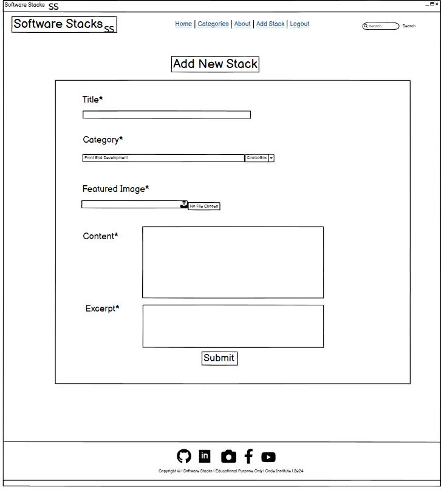

  

<h1 align="center">Software Stacks</h1>

<h2>Welcome</h2>

Link to live website: [CLICK HERE!](https://software-stacks-442e4344b2ad.herokuapp.com/)

# Introduction

## Software Stacks

Welcome to [**Software Stacks**](https://software-stacks-442e4344b2ad.herokuapp.com/), its a dynamic blog platform designed to navigate the evolving landscape of technology. It serves as a bridge connecting enthusiasts, professionals, and curious minds to the core areas of **Advanced Front-End Development**, **E-Commerce**, and **Predictive Analysis**. At Software Stacks, we're committed to demystifying complex tech concepts, showcasing the latest trends, and fostering a community where knowledge and innovation flourish. Whether you're looking to dive deep into code, explore digital commerce, or unlock insights through data analytics, Software Stacks is your go-to digital compass in the tech world.

**Software Stacks** focusing on Django and Bootstrap frameworks, Database manipulation and CRUD functionality. It is for educational purposes only.

### Features

Software Stacks offers a range of features to engage our community, including:

- **Educational Blog Posts:** Dive deep into comprehensive articles covering advanced front-end development, e-commerce solutions, and predictive analytics. Our posts are tailored to inform, educate, and inspire.
- **Community Interaction:** Engage with posts through comments, likes, and bookmarks. Share your thoughts, ask questions, and interact with other members of the community.
- **Resource Hub:** Access a curated selection of resources, and guides. Whether it's learning a new programming language or understanding the nuances of digital marketing in e-commerce, our resource hub has you covered.
- **User Contributions:** Registered users can contribute their own articles, share their expertise, and add to the collective knowledge base of Software Stacks.

### Get Involved

Join Software Stacks today and become part of a community that's shaping the future of technology. Whether you're here to learn, share, or simply explore, we welcome you to our platform. Let's navigate the vast landscape of technology together!

# Table of Contents
- [Introduction](#introduction)
  - [Software Stacks](#software-stacks)
    - [Features](#features)
    - [Get Involved](#get-involved)
- [Table of Contents](#table-of-contents)
- [Overview](#overview)
- [UX - User Experience](#ux---user-experience)
- [Colour Scheme](#colour-scheme)
- [Fonts](#fonts)
    - [Google Fonts](#google-fonts)
      - [Roboto](#roboto)
      - [Lato](#lato)
- [User Stories, Milestones and Epics](#user-stories-milestones-and-epics)
  - [Users Stories](#users-stories)
  - [Epics](#epics)
    - [Epic 1: User Engagement and Interaction](#epic-1-user-engagement-and-interaction)
    - [Epic 2: User Account Management](#epic-2-user-account-management)
    - [Epic 3: Core Platform Development](#epic-3-core-platform-development)
    - [Epic 4: Content Management and Administration](#epic-4-content-management-and-administration)
    - [Epic 5: Community Building and Feedback](#epic-5-community-building-and-feedback)
    - [Epic 6: Documentation and Quality Assurance](#epic-6-documentation-and-quality-assurance)
- [Scope Plane](#scope-plane)
- [Structural Plane](#structural-plane)
- [Wireframes](#wireframes)
    - [Home Page Wireframes](#home-page-wireframes)
    - [Categories Page Wireframes](#categories-page-wireframes)
    - [Post Detail Page Wireframes](#post-detail-page-wireframes)
    - [About \& Contact Page Wireframes](#about--contact-page-wireframes)
    - [Add Stack Page Wireframes](#add-stack-page-wireframes)
    - [Register Page Wireframes](#register-page-wireframes)
    - [Login Page Wireframes](#login-page-wireframes)
    - [Logout Page Wireframes](#logout-page-wireframes)
    - [My Bookmarks Page Wireframes](#my-bookmarks-page-wireframes)
    - [My Likes Page Wireframes](#my-likes-page-wireframes)
    - [My Comments Page Wireframes](#my-comments-page-wireframes)
    - [My Posts Page Wireframes](#my-posts-page-wireframes)
- [Database Schema - Entity Relationship Diagram](#database-schema---entity-relationship-diagram)
    - [Database Schema](#database-schema)
      - [Entity Relationship Diagram (ERD)](#entity-relationship-diagram-erd)
      - [Tables Overview](#tables-overview)
      - [Relationships](#relationships)
      - [Design Considerations](#design-considerations)
  - [Technology Used](#technology-used)
    - [Frontend](#frontend)
    - [Backend](#backend)
    - [Deployment and Version Control](#deployment-and-version-control)
    - [Others](#others)
    - [Development Tools](#development-tools)
    - [Validation Tools](#validation-tools)

# Overview

Software Stacks is an engaging web platform dedicated to the exploration and empowerment within the realms of Advanced Front-End Development, E-Commerce, and Predictive Analysis. It serves as a communal hub for:

- Joining a vibrant community of tech enthusiasts and professionals.
- Creating personalized user profiles to share experiences and insights.
- Contributing and interacting with comprehensive articles and tutorials.
- Discovering cutting-edge trends and best practices in technology domains.
- Facilitating discussions and exchanges within a supportive community.

Accessible across various devices and browsers, Software Stacks aims to simplify complex technology concepts, making them accessible to a diverse audience. Whether you're an experienced developer, an aspiring entrepreneur, or a curious learner, the platform offers tailored resources to support your journey in technology. 

Software Stacks envisions fostering a collaborative ecosystem where users can learn, share, and grow together. By engaging with the platform, members can stay ahead of industry trends, enhance their technical skills, and connect with like-minded individuals. As the platform evolves, future enhancements will include advanced interactive features, further enriching the user experience and community engagement.

# UX - User Experience

The UX design of Software Stacks focuses on simplicity, accessibility, and community engagement to ensure a pleasant and productive experience for all users. Here’s a straightforward breakdown:

- **Intuitive Layout**: Easy-to-navigate menus and a clear structure make finding information straightforward for users of all tech levels.
- **Responsive Design**: The site works smoothly on any device, ensuring users can access content at home or on the move.
- **Engaging Content**: All content is designed to be interesting and useful, with opportunities for users to interact through comments, likes, bookmarks, and write their own posts.
- **Personalization**: Users can customize their experience by setting up profiles, which enhances engagement and helps tailor content to their interests.
- **Community Focus**: It is easy for users to connect, share, and learn from each other.

Overall, the UX design aims to make Software Stacks a welcoming, easy-to-use platform that meets the needs of its diverse user base.

# Colour Scheme

The color scheme for Software Stacks is designed to create a visually appealing and user-friendly interface. Here's a detailed breakdown:

[Coolors](https://coolors.co/) - Colour Scheme for SoftawreStacks website

  
- **#003459 (Navy Blue)**: Used primarily in the `.dark-bg` class for navigation bars, footers, and certain buttons. This deep shade of blue conveys reliability and professionalism, anchoring the design with its strong presence.

- **#007EA7 (Teal)**: This vibrant shade is employed for hover states (`.custom-search-btn:hover`), links, and other interactive elements, adding a pop of color that invites user interaction. It also serves as the color for important buttons and links, guiding users' attention to key actions.

- **#00A8E8 (Deep Teal)**: Utilized for `.btn-signup` and `.btn-edit`, this color denotes actions and editable content, offering a visual cue to users about interactive elements.

- **#E84610 (Bright Red-Orange)**: Allocated for the `.btn-delete` class, this color acts as a warning or alert, indicating a potentially irreversible action, such as deleting content. It's designed to grab attention and prompt the user to proceed with caution.

- **#FFFFFF (White)** and **#00171F (Almost Black)**: These colors are used throughout the `.main-content` and text, ensuring excellent contrast and legibility. White backgrounds for cards and black text create a clean, modern look that's easy on the eyes.

- Additional accents like **#237dd1 (Bright Blue)** for the `.image-flash`, along with hover effects (`:hover` states) and specific icons (`.like-icon i, .bookmark-icon i`), enhance the website's interactive feel, using color to guide and inform user interactions.

This carefully chosen palette not only enhances the aesthetic appeal of Software Stacks but also supports usability and accessibility, making the platform welcoming and easy to navigate for all users.

# Fonts

For the **Software Stacks** project, the selection of fonts plays a crucial role in enhancing readability, ensuring accessibility, and contributing to the overall aesthetic of the application. Below is a detailed explanation of the fonts used in the project, along with their characteristics and reasons for selection.

### Google Fonts

**Software Stacks** utilizes fonts from [Google Fonts](https://fonts.google.com/), a library of free licensed font families, due to its wide variety of choices and easy integration into web projects. Here are the specific fonts used:

#### Roboto
- **Usage**: Primarily for body text.
- **Characteristics**: Modern, sans-serif. Offers great readability on digital screens. Designed with an open curve, making it accessible and friendly to users.
- **Reason for Selection**: Roboto is highly versatile, making it suitable for both body text and headings. Its clear and crisp lines ensure that the content is easy to read, enhancing user engagement.

[Roboto on Google Fonts](https://fonts.google.com/specimen/Roboto)

#### Lato
- **Usage**: Headings and important callouts.
- **Characteristics**: Sans-serif. Features a mixture of curves and straight lines, providing a balance between professionalism and warmth.
- **Reason for Selection**: The semi-rounded details of the letters give Lato a feeling of warmth, while the strong structure provides stability and seriousness. This combination makes it perfect for drawing attention to section headings and important information.

[Lato on Google Fonts](https://fonts.google.com/specimen/Lato)

# User Stories, Milestones and Epics

## Users Stories

**User stories** are a brief statement of intent that captures what a user does or needs to do as part of their job function. They are written in non-technical language and focus on the value or outcome that the user

| Title | User Story | MoSCoW Priority | Milestone |
|-------|------------|----------|-----------|
| Comment on a Post | As a **user**, I want to **comment on a post** so that I can **engage with the content**. | **MUST HAVE** | Core Functionality |
| Bookmark Blog Posts | As a **user**, I want to **bookmark blog posts** so that I can **easily find them later**. | **SHOULD HAVE** | Core Functionality |
| Like Blog Posts | As a **user**, I want to **like blog posts** so that I can **express my appreciation for the content**. | **MUST HAVE** | Core Functionality |
| Account Registration | As a **user**, I want to **register an account** so that I can **interact with the site's features**. | **MUST HAVE** | Core Functionality |
| Browse Without Logging In | As a **user**, I want to **browse without logging in** so that I can **view content without an account**. | **MUST HAVE** | Core Functionality |
| 'Register' and 'Login' Buttons Disappear After 'Login' | As a **user**, I want **'Register' and 'Login' buttons to disappear after 'Login'** so that I can **know I'm logged in**. | **MUST HAVE** | Core Functionality |
| Manage My Posts | As a **user**, I want to **manage my posts** so that I can **control the content I have created**. | **MUST HAVE** | Core Functionality |
| Create Drafts | As a **user**, I want to **create drafts** so that I can **save my content before publishing**. | **MUST HAVE** | Core Functionality |
| Search Blog Posts | As a **user**, I want to **search blog posts** so that I can **find content relevant to my interests**. | **SHOULD HAVE** | Enhanced User Experience |
| View Paginated List of Posts | As a **user**, I want to **view a paginated list of posts** so that I can **easily navigate through content**. | **SHOULD HAVE** | Enhanced User Experience |
| Browse Categories | As a **user**, I want to **browse categories** so that I can **filter the posts by topics of interest**. | **SHOULD HAVE** | Enhanced User Experience |
| Enhance Data Validation | As a **user**, I want **to enhance data validation** so that I can **ensure the integrity of my inputs**. | **SHOULD HAVE** | Enhanced User Experience |
| Edit Existing Blog Post | As a **user**, I want to **edit my existing blog post** so that I can **update or correct information**. | **MUST HAVE** | Content Management |
| Implement Comprehensive Testing | As a **user**, I want to **implement comprehensive testing** so that I can **ensure the application functions correctly**. | **MUST HAVE** | Content Management |
| Delete Existing Blog Posts | As a **user**, I want to **delete existing blog posts** so that I can **remove outdated or incorrect content**. | **SHOULD HAVE** | Content Management |
| Submit Contact Form | As a **user**, I want to **submit a contact form and see it marked as 'read' by site owner** so that I can **know my inquiry has been acknowledged**. | **COULD HAVE** | Community Interaction |
| Modify or Delete My Comment on a Post | As a **user**, I want to **modify or delete my comment on a post** so that I can **manage my interactions**. | **COULD HAVE** | Community Interaction |
| Create Comprehensive Documentation | As a **developer**, I want to **create comprehensive documentation** so that **users and other developers can understand and use the site effectively**. | **MUST HAVE** | Future Considerations |

**A milestone,** represents a significant checkpoint or goal in a project's timeline. Milestones are used to signify the completion of a key phase of work, the achievement of a major objective, or the meeting of a significant deadline. They are critical for tracking progress, setting deadlines, and aligning the team and stakeholders around key project events or achievements. Unlike tasks or user stories, milestones don't involve work themselves but are markers indicating that a specific set of work has been completed.

## Epics

**An epic** in software development and project management is a large body of work that can be broken down into smaller tasks or stories, often referred to as user stories. Epics are used to organize related tasks that contribute toward a significant, unified objective within a project. They help teams to focus on bigger-picture goals and ensure that all the smaller tasks (user stories) are aligned towards achieving that overarching aim. Epics typically span across multiple sprints or iterations and can take several weeks or months to complete.

### Epic 1: User Engagement and Interaction
- **Goal:** Enhance user engagement and community interaction through posts, comments, and social features.
- **Associated User Stories:**
  - Comment on a post
  - Bookmark Blog Posts
  - Like Blog Posts
  - View paginated list of posts
  - Search Blog Posts
  - View comments
  - Navigate easily
  - Modify or delete comment on a post
  - Inquiry via Contact Section

### Epic 2: User Account Management
- **Goal:** Provide a seamless and secure user experience from account registration through to content management.
- **Associated User Stories:**
  - Account Registration
  - 'Register' and 'Login' buttons disappear after 'Login'.
  - Manage posts
  - Create drafts
  - Edit Existing Blog Post
  - Approve comments
  - Delete Existing Blog Post
  - Add Post USER STORY: Allow Registered user to Create New Posts

### Epic 3: Core Platform Development
- **Goal:** Establish the foundational elements of the Software Stacks platform, including database creation, deployment, and basic functionalities.
- **Associated User Stories:**
  - Creating the Database in ElephantSQL
  - Deploying the Django Project on Heroku
  - Software Stacks Blog
  - Create Project App
  - Open a Post
  - Browse without Logging in

### Epic 4: Content Management and Administration
- **Goal:** Empower authors with comprehensive tools for content creation, modification, and management.
- **Associated User Stories:**
  - EDIT POST USER STORY: Enable Post Modifications by Author/Post Owner.
  - DELETE POST USER STORY: Facilitate Removal of Outdated or Incorrect Posts
  - ADD POST USER STORY: Allow Registered user to Create New Posts
  - TESTING: Implement Comprehensive Testing
  - VALIDATION: Enhance Data Validation

### Epic 5: Community Building and Feedback
- **Goal:** Foster community interaction and feedback through enhanced contact form functionalities and about page updates.
- **Associated User Stories:**
  - CONTACT FORM USER STORY: Marking Contact Requests as "Read"
  - CONTACT FORM USER STORY: Contact Form Submission Feature(Site Owner)
  - CONTACT FORM USER STORY: Contact Form Submission Feature (Registered User)
  - ABOUT APP USER STORY: Add and update the about text
  - ABOUT APP USER STORY: Read about the site

### Epic 6: Documentation and Quality Assurance
- **Goal:** Ensure the platform's reliability and ease of use through comprehensive documentation, testing, and data validation.
- **Associated User Stories:**
  - DOCUMENTATION: Create Comprehensive Documentation
  - VALIDATION: Enhance Data Validation
  - TESTING: Implement Comprehensive Testing

Each epic captures a significant area of functionality or development goal, providing a roadmap for progressing from initial platform setup to a fully-featured, user-engaged community platform.

# Scope Plane

**Purpose:**
Software Stacks aims to educate and engage users interested in various software technologies, focusing on Front-End Development, E-Commerce, and Predictive Analysis. It serves as a platform for both novice and experienced developers to explore articles, tutorials, and community insights.

**Goals:**
- Provide comprehensive guides and articles on key software development topics.
- Offer a community-driven platform where users can interact, and learn from each other.
- Enable users to stay updated with the latest trends and best practices in software technology.

**Target Audience:**
- Novice to experienced software developers.
- Individuals interested in the practical applications of software technology in business.
- Educators and students looking for resources on software development and technology trends.

**User Needs:**
- Access to reliable and up-to-date information.
- Ability to interact with other community members.
- Tools to navigate content based on specific interests or needs.

**Features:**
- Detailed articles and blog posts categorized by technology themes.
- Community forums for discussion and questions.
- Regular updates and new content notifications.
- User profiles for personalized experiences and content tracking.

# Structural Plane

**Information Architecture:**
- **Home Page:** Overview of the site, featured articles, and direct access to major categories.
- **Category Pages:** Dedicated pages for each major topic (Front-End Development, E-Commerce, Predictive Analysis) featuring articles.
- **Article Detail Pages:** Comprehensive content on chosen topics, including images, and more information.
- **About & Contact Pages:** Organized by category to facilitate discussions and interactions among users.
- **Registration and SignIn Page:** Users can signup and signin to more interactions.
- **User Profile:** Personalized area where users can manage their preferences, saved articles, and contributions to discussions.

**Navigation:**
- **Primary Navigation:** Direct links to each major category from every page.
- **Secondary Navigation:** Links to user profiles, contact information, and about page.
- **Footer Navigation:** Links to privacy policy, terms of use,  and social media.

**Interaction Design:**
- Responsive design to ensure usability across devices.
- Interactive elements such as buttons, links, and forms are designed for ease of use.
- Visual cues (icons, color changes) for interactive elements to enhance user experience.

**Wireframes:**
- Home Page: Features a carousel of featured articles, a quick summary of categories, and a latest articles section.
- Category Pages: List articles with brief summaries, sortable by popularity or date.
- Article Detail Page: Rich content layout with sidebars for related articles and author info.

**Accessibility:**
- Ensure all content and navigation is accessible with keyboard and screen readers.
- Use appropriate ARIA labels and roles for dynamic content.

These sections of the README provide a clear overview of what the project aims to achieve and how it's structured to meet the needs of its users. This structure not only helps developers and contributors understand the project's scope but also guides the end-users in navigating and making the most out of the platform.

# Wireframes

I've used [Balsamiq](https://balsamiq.com/wireframes) to design my site wireframes.

### Home Page Wireframes

Click to View Home Page wireframes

**Mobile**

**Tablet**

**Desktop**

### Categories Page Wireframes

Click to View Categories Page wireframes

**Desktop**

### Post Detail Page Wireframes

Click to View Post Detail Page wireframes

**Desktop**

### About & Contact Page Wireframes

Click to View About & Contact Page wireframes

**Desktop**

### Add Stack Page Wireframes

Click to View Add Stack Page wireframes

**Desktop**

### Register Page Wireframes

Click to View Register Page wireframes

**Desktop**

### Login Page Wireframes

Click to View Login Page wireframes

**Desktop**

### Logout Page Wireframes

Click to View Logout Page wireframes

**Desktop**

### My Bookmarks Page Wireframes

Click to View My Bookmarks Page wireframes

**Desktop**

### My Likes Page Wireframes

Click to View My Likes Page wireframes

**Desktop**

### My Comments Page Wireframes

Click to View My Comments Page wireframes

**Desktop**

### My Posts Page Wireframes

Click to View My Posts Page wireframes

**Desktop**

# Database Schema - Entity Relationship Diagram

I've used [dbdiagram](https://dbdiagram.io/home) to design my site's ERD.

### Database Schema

The Software Stacks application is structured on a robust database schema designed to facilitate the efficient organization and retrieval of data. Below is an overview of the database schema and the relationships between the different entities.

#### Entity Relationship Diagram (ERD)

The Entity Relationship Diagram (ERD) represents the database schema of Software Stacks, detailing the system's tables, the data fields within them, and the relationships between the tables.

#### Tables Overview

- **User**: Stores information about the users of the platform, including username, email, and password. The `is_staff` field indicates whether a user has administrative privileges.

- **Profile**: Contains extended user information such as name, join date, and bookmarks. This table extends the `User` table by associating profiles with user accounts.

- **Blog**: Central to the application, the `Blog` table holds data about blog posts including title, content, and metadata like creation date and whether the post is approved for public viewing.

- **Comment**: Enables the community aspect of the blog by storing user comments on blog posts. Each comment is linked to a specific post and user.

- **Category**: Categories allow for the organization of blog posts into topics, making it easier for users to find content related to specific subjects.

- **About**: This table likely contains static information about the application, such as the company's background, mission statement, and contact details.

- **Contact**: Presumably used for storing user inquiries submitted through the platform's contact form.

#### Relationships

- A **one-to-many** relationship exists between `User` and `Blog`, where one user can author many blog posts.
- A similar **one-to-many** relationship is set between `Blog` and `Comment`, allowing multiple comments to be associated with a single blog post.
- The `Profile` table has a **one-to-one** relationship with the `User` table, extending it with additional personal information.
- The `Category` table is linked to the `Blog` table in a **many-to-one** relationship, categorizing each blog post.
  
#### Design Considerations

The schema was designed with scalability in mind, ensuring that as the platform grows, new features and data types can be easily incorporated. For example, the separation of the `User` and `Profile` tables allows for flexible user management and the possibility to include additional user attributes in the future without altering the core user authentication system.

**CSRF Tokens** 

CSRF (Cross-Site Request Forgery) tokens are included in every form to help authenticate the request with the server when the form is submitted. Absence of these tokens can leave a site vulnerable to attackers who may steal a users data.

**AllAuth**  

Django AllAuth is an installable framework that takes care of the user registration and authentication process. Authentication was needed to determine when a user was registered or unregistered and it controlled what content was accessible on **SoftwareStacks**

## Technology Used

### Frontend
- [**HTML5**](https://developer.mozilla.org/en-US/docs/Web/Guide/HTML/HTML5): Structure of the web pages.
- [**CSS3**](https://developer.mozilla.org/en-US/docs/Web/CSS): Styling of the web content.
- [**JavaScript**](https://developer.mozilla.org/en-US/docs/Web/JavaScript): Enhancements of interactivity and web behaviors.
- [**Bootstrap**](https://getbootstrap.com/): Responsive design and layout framework.

### Backend
- [**Django**](https://www.djangoproject.com/): A high-level Python web framework.
- [**Python**](https://www.python.org/): Backend programming language.
- [**SQLite**](https://www.sqlite.org/index.html) (Development) / [**PostgreSQL**](https://www.postgresql.org/) (Production): Database systems.

### Deployment and Version Control
- [**Git**](https://git-scm.com/): Used for version control.
- [**GitHub**](https://github.com/): Hosts the repository and facilitates version control and collaboration.
- [**Heroku**](https://www.heroku.com/): Platform as a service (PaaS) for deploying applications.

### Others
- [**Cloudinary**](https://cloudinary.com/): An end-to-end image and video management solution.
- [**Favicon.io**](https://favicon.io/): To generate favicon icons for the website.
- [**Font Awesome**](https://fontawesome.com/): Provides icons for enhancing UI/UX.

### Development Tools
- [**GitPod**](https://www.gitpod.io/): Preferred IDE for writing and editing code.
- [**Django Extensions**](https://github.com/django-extensions/django-extensions): Provides custom management extensions for Django.

### Validation Tools
- [**W3C Markup Validation Service**](https://validator.w3.org/): For validating HTML5 code.
- [**W3C CSS Validation Service**](https://jigsaw.w3.org/css-validator/): For validating CSS3 code.
- [**JSHint**](https://jshint.com/): A tool that helps to detect errors and potential problems in JavaScript code.
- [**CI Python Linter**](https://pep8ci.herokuapp.com/): Analyzes Python code to look for bugs and signs of poor quality.
- [**Google Lighthouse**](https://developers.google.com/web/tools/lighthouse): For auditing performance, accessibility, and search engine optimization of web pages.

