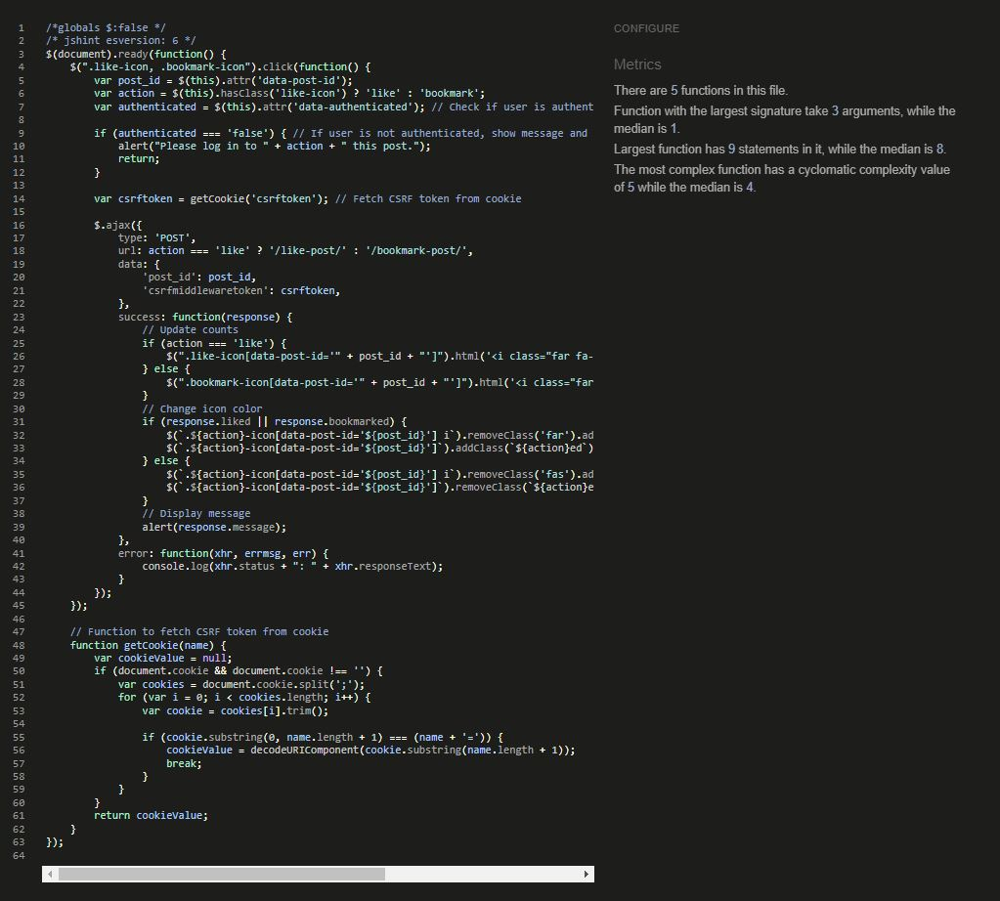

# Testing

This is the TESTING file for the [SoftwareStacks](https://software-stacks-442e4344b2ad.herokuapp.com/) website.

Return back to the [README.md](README.md) file.

## Testing  Table of Contents  
- Testing
  - Testing Table of Contents

## Validation 

To ensure the reliability, usability, and accessibility of Software Stacks, various validation methodologies were implemented. These tvalidations ensure that the application not only meets development standards but also provides a seamless user experience across different platforms and browsers. Below is an overview of the validation processes:

#### HTML Validation
- **Tool Used:** [HTML W3C Markup Validator](https://validator.w3.org/)
- **Purpose:** Validates the HTML code of the application to ensure it is free from syntax errors and adheres to the standards set by the World Wide Web Consortium (W3C).
- **Process:** All HTML pages of the Software Stacks are checked through the W3C validator to identify and fix any markup errors or warnings.

**HTML Validation Results**

Below is a table summarizing the HTML validation results for various pages of the Software Stacks website. This validation ensures that the HTML is up to standards, improving cross-browser compatibility, and enhancing SEO performance.

| HTML Source Code/Page        | Validation Results PDF                | Errors | Warnings |
|------------------------------|---------------------------------------|--------|----------|
| **Main Page**                | [View PDF](path/to/base-page.pdf) | 0      | 2        |
| **Home Page**                | [View PDF](path/to/home-page.pdf) | 0      | 2        |
| **About & Contact Page**     | [View PDF](path/to/about-page.pdf)| 1      | 1        |
| **Categories Page**          | [View PDF](path/to/categories.pdf) | 1      | 1        |
| **Search Results Page**      | [View PDF](path/to/search-page.pdf)| 1      | 1        |
| **Register Page**            | [View PDF](path/to/register-page.pdf) | 0    | 0        |
| **Login Page**               | [View PDF](path/to/login-page.pdf) | 2      | 3        |
| **Logout Page**              | [View PDF](path/to/logout-page.pdf)| 2      | 3        |
| **Post Detail**              | [View PDF](path/to/post-detail.pdf)| 0      | 1        |
| **Add Stack Page**           | [View PDF](path/to/add-stack.pdf)  | 0      | 1        |
| **My Bookmarks Page**        | [View PDF](path/to/bookmarks-page.pdf)| 2   | 3        |
| **My Likes Page**            | [View PDF](path/to/likes-page.pdf) | 2      | 3        |
| **My Comments Page**         | [View PDF](path/to/comments-page.pdf)| 2   | 3        |
| **My Posts Page**            | [View PDF](path/to/posts-page.pdf) | 2      | 3        |
| **403 Page**                 | [View PDF](path/to/403-page.pdf)   | 2      | 3        |
| **404 Page**                 | [View PDF](path/to/404-page.pdf)   | 2      | 3        |
| **500 Page**                 | [View PDF](path/to/500-page.pdf)   | 2      | 3        |

- **Errors** are the actual HTML issues that need to be fixed as they may affect the functionality or appearance of the website.
- **Warnings** are generally suggestions for best practices, which are not critical but could improve the code efficiency or accessibility.

#### CSS Validation
- **Tool Used:** [W3C CSS Validator](https://jigsaw.w3.org/css-validator/)
- **Purpose:** Ensures that the CSS code used across the platform adheres to the standards set by the W3C and is free of errors.
- **Process:** The CSS files are submitted to the W3C CSS Validator. Corrections are made based on feedback to improve performance and cross-browser compatibility.

**[CSS Results PDF](https://github.com/SwathiKeshavamurthy/SoftwareStacks-P4/blob/main/documentation/validation/css.pdf)**

#### JavaScript Validation
- **Tool Used:** [JSLint/JSHint](https://jshint.com/)
- **Purpose:** To detect errors and potential problems in the JavaScript code, making sure that all scripts run efficiently and are error-free.
- **Process:** JavaScript code is run through JSLint/JSHint to identify issues related to syntax, deprecated methods, and other inefficiencies.

Below is a table summarizing the JavaScript validation results for specific files within the Software Stacks website. 

| JavaScript File              | Results Screenshots               | Errors | Warnings |
|------------------------------|--------------------------------------|--------|----------|
| **comments.js**                  |   | 0      | 0        |
| **like_bookmark.js**            |  | 0  | 0        |
| **post.js**         |  | 0 | 0        |

#### Python Validation
- **Tool Used:** [CI Python Linter](https://pep8ci.herokuapp.com/#)
- **Purpose:** Analyzes Python source code to identify coding errors, enforce a coding standard, and look for code smells.
- **Process:** Python code within Software Stacks is analyzed with Pylint to ensure adherence to coding standards and to improve code quality.

**Project Module Python Validation Results**
| Python File                | Results Screenshots                        | Errors | Warnings |
|----------------------------|--------------------------------------------|--------|----------|
| **settings.py**            |  | 1      | 0        |
| **manage.py**            |  | 1      | 0        |
| **urls.py**                |      | 0      | 0        |
| **views.py**                |      | 0      | 0        |
| **wsgi.py**                |      | 0      | 1        |
| **asgi.py**                |      | 0      | 0        |

**Blog Module Python Validation Results**

| Python File                | Results Screenshots                        | Errors | Warnings |
|----------------------------|--------------------------------------------|--------|----------|
| **views.py**               |    | 2      | 1        |
| **models.py**              |   | 0      | 2        |
| **forms.py**               |    | 1      | 0        |
| **urls.py**                | | 0      | 0        |
| **admin.py**               |    | 2      | 1        |
| **apps.py**              |   | 0      | 2        |
| **forms.py**               |    | 2      | 1        |

**About Module Python Validation Results**

| Python File                | Results Screenshots                        | Errors | Warnings |
|----------------------------|--------------------------------------------|--------|----------|
| **views.py**               |    | 1      | 1        |
| **models.py**              |   | 0      | 0        |
| **forms.py**               |    | 0      | 1        |
| **urls.py**                |      | 0      | 0        |
| **admin.py**               |    | 2      | 1        |
| **apps.py**              |   | 0      | 2        |
| **forms.py**               |    | 2      | 1        |

#### Lighthouse Scores
- **Tool Used:** [Google Lighthouse](https://en.wikipedia.org/wiki/Google_Lighthouse)
- **Purpose:** To assess the quality of web pages in terms of performance, accessibility, progressive web apps, SEO, and best practices.
- **Process:** Software Stacks is tested with Google Lighthouse, which provides a detailed report on various aspects of the site’s performance and offers recommendations for improvement.

#### Wave Accessibility Evaluation
- **Tool Used:** [Wave Web Accessibility Evaluation Tool](https://en.wikipedia.org/wiki/WebAIM)
- **Purpose:** To ensure that the website is accessible to individuals with disabilities by identifying and suggesting fixes for web accessibility issues.
- **Process:** The Wave tool evaluates each page of Software Stacks to ensure it complies with accessibility standards like WCAG and Section 508.
